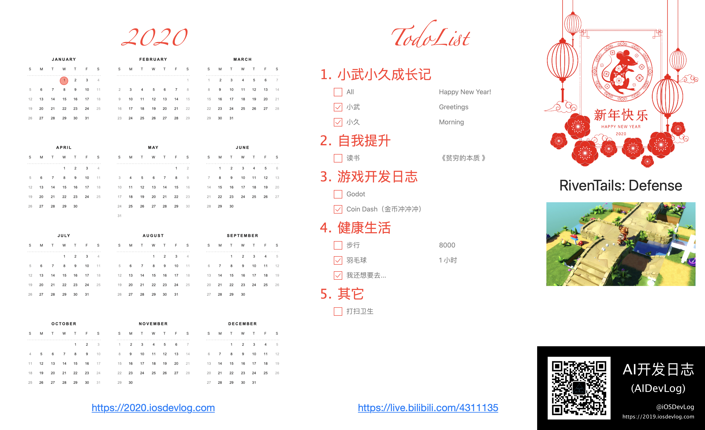
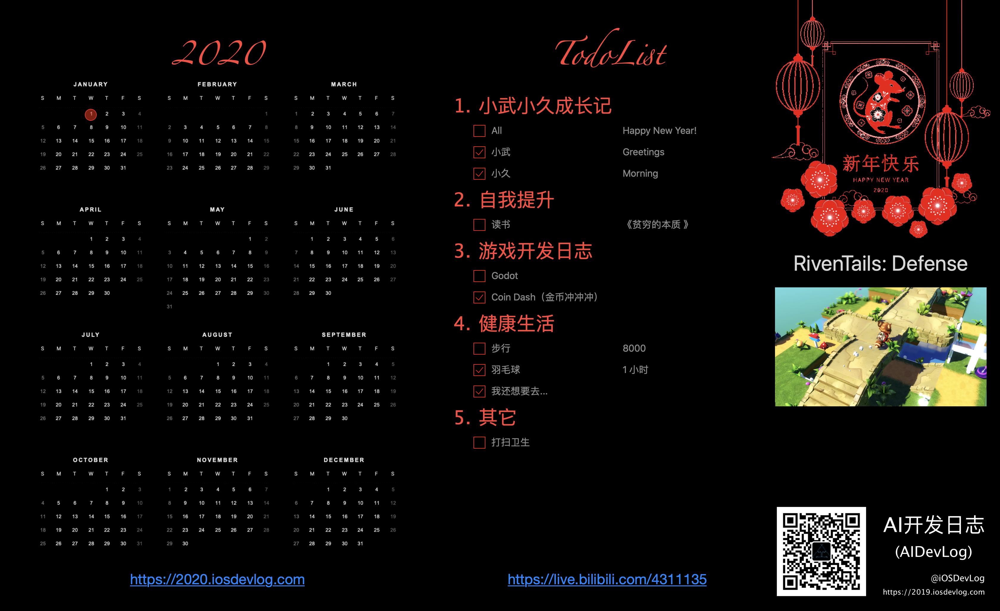

# Calendar2020
---

The Year Of Rat Calendar for macOS / 鼠年日历

## 展示

今天是 2019 年的最后一天，又是留下很多遗憾的一年。

把 2019 年做所计划改成 2019，又可以当成 2020 年的年计划了。

对了，我好像 2018 年没有制定 2019 年的计划啊。

今年买了 Kindle ，也买了[Kindle Unlimited](https://www.amazon.com/Browse-Kindle-Unlimited-Books/b?ie=UTF8&node=9069934011)

，也在微信读书上面读了一些书，早些时候还在 蜗牛读书 上面看过了少书。

在微信读书和 Kindle 上面主要是看了几本网络小说，其中追了一本《余罪》作者的新书《弹弓神警》。这两本小说内容类似，都是从卧底开始，主角技术出众，但都学历不高，虽然很有能力，想要更多的资源分配还是比较困难。

当然还是看的技术书比较多一点，问题看技术书籍，写技术博客，技术之外的事情部关注的少了。

我在看《余罪》这本书时，上面的评论很多都是在讲张一山，我没有看过《余罪》电视剧。本来我就不怎么喜欢看电视剧，我是觉得看电视剧比较花费时间，不过当大家都在讨论一件事情，而你根本不明白别人讨论的内容时，就很难与人交流。

《乌合之众：大众心理研究》是一本研究大众心理学的著作。在书中，勒庞阐述了群体以及群体心理的特征，指出了当个人是一个孤立的个体时，他有着自己鲜明的个性化特征，而当这个人融入了群体后，他的所有个性都会被这个群体所淹没，他的思想立刻就会被群体的思想所取代。而当一个群体存在时，他就有着情绪化、无异议、低智商等特征。

这就让我想到了英国脱欧的事情，等到真的实现了，大部分人又都后悔了，还想要重选。很多人并不知道自己的选择是什么，也都觉得自己的票怎么投都无所谓，没有独立思考过后果。

这有媒体宣传的原因，也有责任分散的影响。`键盘侠` 可不是一个好词，有时候就是 `键盘侠` 们有意无意的议论，造成过很多不可挽回的后果，当询问他们为什么要这么做，很多就都觉得自己没有什么大错，这结果不是自己的行为造成的。

只看技术文档，没有出动走动，我变得很宅。我几乎从不主动跟别人联系，没有主动打过电话。与别人合作的事情，也没有主动报告进度，就连聊天工具都很长时间才看一次，有时看了也不回得一下。

与此相反，有一个朋友就能很快回复消息，只要一有他相关的消息，根本是秒回，我觉得我需要改变一下了，不能再被动的接收消息，我应该主动与别人去交流。

随着宅的时间越来越长，平时的运动也是越来越少了。最近基本每个月踢两三场足球，体重也是超标。这几个月一直在想着减肥，去年报的健身，基本没有去过几次，钱等于白交了。

这个月天天称电子称，从 72.8 公斤减到最低时的 69.6 公斤，现在基本在 70 公司左右。再起减一点都不太容易，2020 年，我需要把健康捡起来，合理用眼。我居然没有近视，不过现在是觉得视力有点下降，特别是左眼已经有点模糊。

前两年建了一个《小武成长记》的网站，https://2015.iosdevlog.com，2019 年基本没有怎么更新。现在把网站名字改成《小武小久成长记》，2020 年我期望每天都记录他们的成长。

我发现游戏很容易让人沉迷，为什么会这样呢？

*   [绘画](https://zh.wikipedia.org/wiki/%E7%B9%AA%E7%95%AB "绘画")

*   [雕塑](https://zh.wikipedia.org/wiki/%E9%9B%95%E5%A1%91 "雕塑")

*   [建筑](https://zh.wikipedia.org/wiki/%E5%BB%BA%E7%AF%89 "建筑")

*   [音乐](https://zh.wikipedia.org/wiki/%E9%9F%B3%E6%A8%82 "音乐")

*   [文学](https://zh.wikipedia.org/wiki/%E6%96%87%E5%AD%B8 "文学")

*   [舞蹈](https://zh.wikipedia.org/wiki/%E8%88%9E%E8%B9%88 "舞蹈")

*   [戏剧](https://zh.wikipedia.org/wiki/%E6%88%B2%E5%8A%87 "戏剧")

*   [电影](https://zh.wikipedia.org/wiki/%E9%9B%BB%E5%BD%B1 "电影")

第九艺术是指传统八大艺术（[绘画](https://baike.baidu.com/item/%E7%BB%98%E7%94%BB/612451)、[雕刻](https://baike.baidu.com/item/%E9%9B%95%E5%88%BB/1496725)、建筑、[音乐](https://baike.baidu.com/item/%E9%9F%B3%E4%B9%90/61907)、[诗歌](https://baike.baidu.com/item/%E8%AF%97%E6%AD%8C/5555)（[文学](https://baike.baidu.com/item/%E6%96%87%E5%AD%A6/6437)）、[舞蹈](https://baike.baidu.com/item/%E8%88%9E%E8%B9%88/6228)、[戏剧、电影](https://baike.baidu.com/item/%E6%88%8F%E5%89%A7%E3%80%81%E7%94%B5%E5%BD%B1/29000)）之外的某种艺术形式，在不同的资料中有不同的认定，如：电视艺术、电视剧、漫画书、电子游戏 [1] 等。现第九艺术通常指[电子游戏](https://baike.baidu.com/item/%E7%94%B5%E5%AD%90%E6%B8%B8%E6%88%8F/195750)。

游戏基本上包含了之前的八种艺术形式，而电子游戏（Video Game）更容易让人深入。

火的电子游戏，比如《愤怒的小鸟》，《Flappy Bird》，《消消乐》等游戏都提供了即时反馈，而且难度都设计的刚刚好，不会让你觉得太难，又不会那么容易过关。

### 大型网络游戏，竞技游戏，更是吸引众多的玩家，还有很多人希望 *电子竞技* 能成为运动会（亚运会，奥运会）和比赛项目。

最新的技术也大多会应用到游戏上面，比如 AR/ VR 等。 另外像人工智能也有一些技术会​应用到游戏上面。棋类运动比较多，其它的像闪关游戏，强化学习就用的比较多很，容易就可以看到效果，​多有意思。

2020 年我希望每天都在  B 站直播一点小游戏的开发，不期望能取得什么收入，而是想从制作吸引人的游戏开始能做出吸引人的​产品。

为什么想直播​呢？我之前都是自己想写写(https://2019.iosdevlog，简书等)，想说说（《iOS 开发日志》的播客），也没有什么反馈。也翻译了点项目(https://github.com/virgili0/Virgilio)，我参与翻译了大部分中文版，后来的更新我就没有继续翻译了。每次我上 TG，@[clone95](https://github.com/clone95) 都会向我打招呼，我又没有翻译内容，后来干脆不上 TG​。

根据学习金字塔理论，主要学习效率是最高的，特别是教授给他人，嗯，就这么办，我直播我学习到的内容，把别人交会了，我自己不就​懂了吗？

所以我就创建了 **2020 年漂亮的程序员日历**（夸张的说法）​。

大家可以点击 原文去 *GitHub* 查看下载地址，这个是 macOS 最新版的，只完成了部分功能。

我希望后期的功能有根据每个月的日历生成视频，这样每个月底自己的进度一目了然，到了年底也可以给别人展示一下自己这一年有没有​虚度。

最后期望小伙伴们能在 <https://github.com/gamedevlog/Calendar2020> 给我一个 star，明年再见。

## Contact / 联系方式

Website/网站: [http://game.iosdevlog.com/](https://game.iosdevlog.com/)

WeChat Official Account / 微信公众号:

* iOSDevLog / iOS开发日志
* AIDevLog / AI开发日志

## License / 许可

Calendar2020 is released under the MIT license. See [LICENSE](LICENSE) for details.